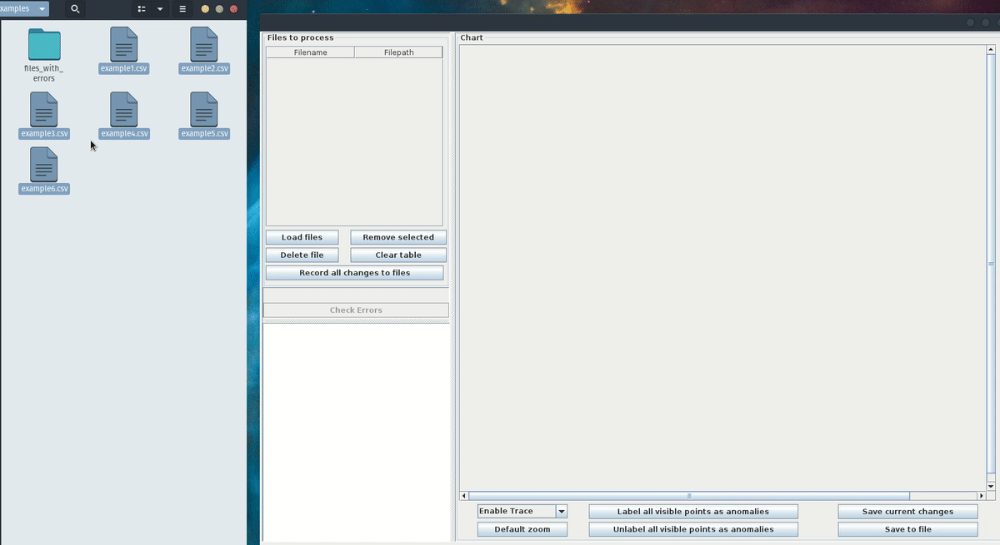
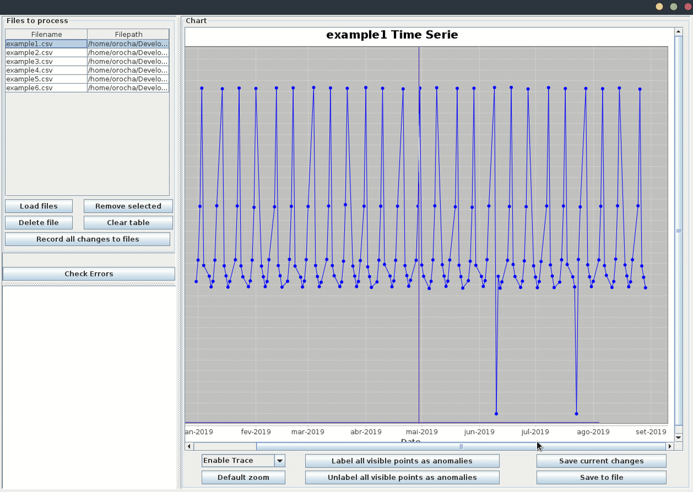
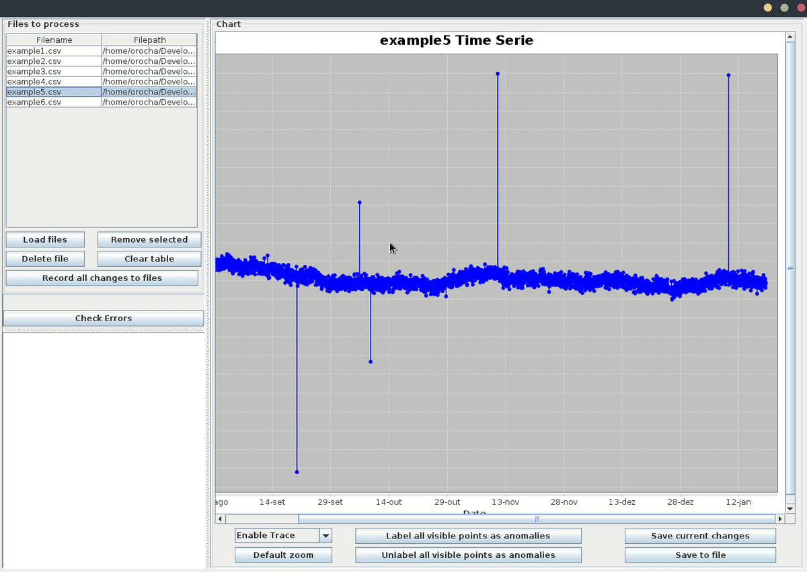
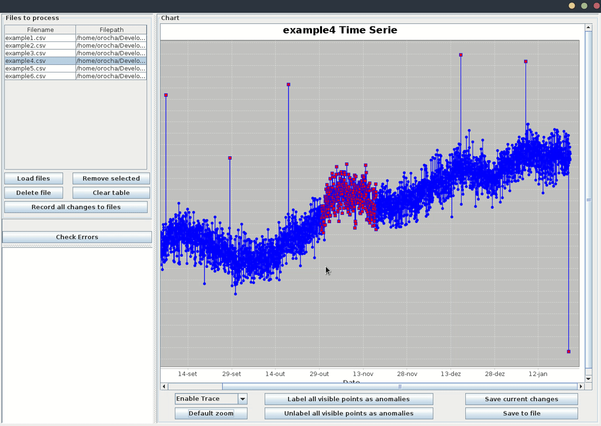

TSLabeler is a simple tool designed to label anomalies, manually, in univariate or multivariate time series.

What can this tool be useful for? Usually, time series anomaly detection methods need to be evaluated using labeled data, also known as the ground of truth. This evaluation is performed to check their performance or compare if a method is better than other in detecting anomalies. Moreover, the labeled data can also be used to train supervised learning methods for detecting anomalies in time series.

## Input file format:

Currently, only comma-separated values (.csv) file format is supported.

----------------------------------------------------
### File structure:

**Univariate:**

| Date                    | Value   | Anomaly |
|-------------------------|---------|---------|
| 2019-01-01T00:00:00.000 | 123.4   | 0       |
| 2019-01-02T00:00:00.000 | 3452.98 | 1       |
| ...                     | ...     | ...     |

**Multivariate:**
| Date                    | Var1    | Var2 | ... | Anomaly |
|-------------------------|---------|------|-----|---------|
| 2019-01-01T00:00:00.000 | 123.4   | 34   | ... | 0       |
| 2019-01-02T00:00:00.000 | 3452.98 | 67   | ... | 1       |
| ...                     | ...     | ...  | ... | ...     |

**Fields description:**

| Attribute | Description                                            | Example                     | Suported values   |
|-----------|--------------------------------------------------------|-----------------------------|-------------------|
| Date      | Mandatory field                                        | 2018-12-31T00:00:00         | Date ISO 8601     |
| Value(s)  | Mandatory field(s), 1 or multiple columns are supported | 234.3 or 234                | Double or integer |
| Anomaly   | optional field                                         | 1 (if anomaly), otherwise 0 | integer           |

_____________________________________

## Examples:

### 1. Open files  

### 2. Label anomalies by clicking over point

### 3. Label several anomalies at once

### 4. Unlabel several anomalies at once

### 5. Scroll through the plot to identify and label anomalies
   Just press "Ctrl" in the keyboard 
